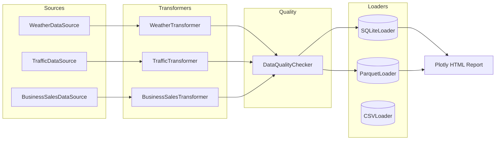

# public-data-etl-pipeline

[](https://github.com/MSeyyidDev/public-data-etl-pipeline/actions/workflows/ci.yml)
[](https://www.python.org/downloads/)
[](LICENSE)

A clean, object-oriented ETL pipeline written in Python 3.11+ that ingests, validates,
transforms and stores three independent datasets to a typed SQLite warehouse and
parquet snapshots. Synthetic generators stand in for real public data feeds so the
project always runs offline and reproducibly, while the architecture is a drop-in
fit for real public APIs (NOAA, Open-Meteo, Eurostat, city open-data portals).

**Static demo:** the generated analyst report is published from `site/` via
GitHub Pages. After enabling Pages for the repository, the demo URL will be
`https://mseyyiddev.github.io/public-data-etl-pipeline/`.

## Why this project

Hiring managers and reviewers want to see clean separation of concerns, real data
engineering hygiene, and tests that mean something. This project demonstrates:

- An **abstract `DataSource` / `Transformer` / `Loader`** layout so new sources can
  be added in one file without touching the pipeline code.
- A composable `Pipeline` orchestrator that emits **per-stage metrics** (rows in,
  rows out, nulls handled, duration) and **structured logs**.
- A reusable **`DataQualityChecker`** that runs schema, nullability, range and
  uniqueness assertions and persists results to the warehouse.
- ~120k synthetic rows across three domains (weather, traffic, sales) with
  realistic patterns: diurnal/seasonal weather cycles, weekday/weekend traffic
  rush hours, promo-driven sales spikes plus a customer/product star schema.
- A **Typer CLI** (`etl run`, `etl run-all`, `etl quality-report`, `etl preview`,
  `etl export`, `etl report`) and an optional Plotly HTML report.

## Architecture



Each pipeline run is a `Pipeline(source, transformer, loaders, quality_checker)`
instance. The orchestrator times every stage, captures null-handling counts, and
produces a structured `PipelineResult` that is pretty-printed via Rich.

## Tech stack

- **Python 3.11+ / 3.13**
- pandas 2 + numpy for transforms
- SQLAlchemy 2.0 + SQLite for the warehouse
- pyarrow for parquet snapshots
- Pydantic v2 for row schemas
- Faker for synthetic identities
- Typer + Rich for the CLI
- Plotly + Jinja2 for the HTML report
- pytest for testing

## Project layout

```
etl/
  config.py             # env-driven settings
  logging_setup.py      # rich-powered structured logs
  pipeline.py           # Pipeline orchestrator + PipelineResult
  factory.py            # builds source/transformer/loader for each domain
  cli.py                # Typer commands
  report.py             # optional Plotly HTML report
  schemas.py            # Pydantic row models
  sources/
    base.py             # DataSource ABC
    weather.py          # synthetic weather generator
    traffic.py          # synthetic traffic generator
    sales.py            # synthetic e-commerce generator (+ dim tables)
  transformers/
    base.py             # Transformer ABC
    weather.py
    traffic.py
    sales.py
  loaders/
    base.py             # Loader ABC
    sqlite_loader.py
    csv_loader.py
    parquet_loader.py
  quality/
    checker.py          # DataQualityChecker + default checkers
templates/
  report.html.j2        # Jinja2 template for the Plotly report
tests/                  # pytest suite (sources, transformers, loaders, quality, pipeline, CLI)
output/                 # generated SQLite/parquet/HTML artifacts (gitignored)
```

## Datasets

| Source  | Rows                | Time range          | Highlights                                                  |
|---------|---------------------|---------------------|-------------------------------------------------------------|
| Weather | 5 cities x 365d x 24h = 43,800 | one calendar year   | diurnal + seasonal patterns, storms, ~2% injected nulls, OOR outliers |
| Traffic | 20 sensors x 90d x 24h = 43,200 | quarter-year window | weekday vs weekend rush-hour curves, occupancy, congestion  |
| Sales   | 50 products x 365d = 18,250 fact rows + 1,000 customers + 50 products | one calendar year   | trend, seasonality, weekend boost, promo spikes, returns    |

### Schema (warehouse tables)

`weather_facts(city, timestamp, temperature_c, humidity, pressure_hpa, wind_kmh,
precipitation_mm, condition, heat_index, comfort_score, is_extreme, date, hour)`

`traffic_facts(sensor_id, road, timestamp, vehicle_count, avg_speed_kmh,
occupancy_pct, hour, day_of_week, is_weekend, peak_flag, congestion_index,
free_flow_ratio)`

`sales_facts(date, product_id, product_name, category, units_sold, unit_price,
revenue, returns, unit_cost, margin, gross_profit, revenue_7d_avg, year_month,
monthly_revenue, mom_growth, net_revenue, weekday, is_weekend)`

`dim_customers(customer_id, name, email, country, signup_date, segment)`

`dim_products(product_id, product_name, category, unit_cost, list_price)`

`quality_reports(source, check_name, passed, details, timestamp)`

## Setup

```bash
python -m venv .venv
source .venv/bin/activate   # on Windows: .venv\Scripts\activate
pip install -r requirements.txt
pip install -e .
```

## Run

```bash
# end-to-end: extract -> transform -> quality -> load all three sources
etl run-all

# single source
etl run --source weather
etl run --source traffic
etl run --source sales

# preview the head of a transformed dataset
etl preview --source weather --rows 5

# run quality checks across all sources, persist results to SQLite
etl quality-report

# export already-loaded warehouse tables
etl export --format csv
etl export --format json --source sales

# optional Plotly HTML report (writes output/report.html)
etl report

# show config
etl info
```

`make install run quality test report` cover the same flow from a Makefile.

## Quality report

`etl quality-report` runs the canonical `DataQualityChecker` for each source against
the freshly-transformed frame. Each check produces a row in the `quality_reports`
SQLite table with `passed`, `details` and `timestamp`. Default checks include:

- non-empty frame
- required columns present
- non-null thresholds for critical columns
- numeric range validation (e.g. humidity in [0, 100], congestion_index in [0, 1])
- composite-key uniqueness (e.g. `(city, timestamp)`, `(product_id, date)`)

## Sample insights produced

- Mean comfort score per city and month (weather)
- Free-flow speed ratio and peak-hour congestion per road (traffic)
- Daily, monthly and rolling 7-day revenue per product, plus MoM growth (sales)

## Tests

```bash
pytest
```

The suite covers each transformer (logic + null handling + outlier handling),
each loader (in-memory SQLite, file SQLite, CSV, parquet), the quality checker
(every check kind), the source generators (shape + determinism), an end-to-end
pipeline run against in-memory SQLite, and the Typer CLI.

## Generalizing to real public data

Each `DataSource` subclass owns its own ingestion. Replacing `WeatherDataSource`
with a real Open-Meteo client would only require implementing `extract() ->
pd.DataFrame` with the same column contract; the transformer, quality checker
and loaders are unchanged.

## Demo output

`site/report.html` is a committed static copy of the generated Plotly report.
Regenerate it with:

```bash
etl run-all
etl quality-report
etl report
cp output/report.html site/report.html
```

## License

MIT.
